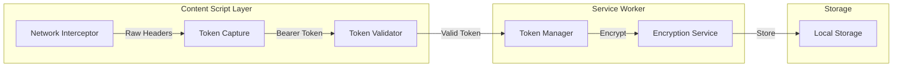
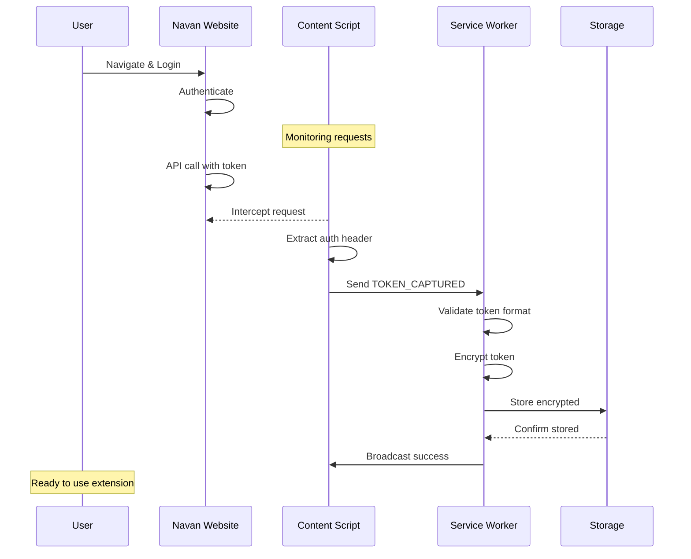
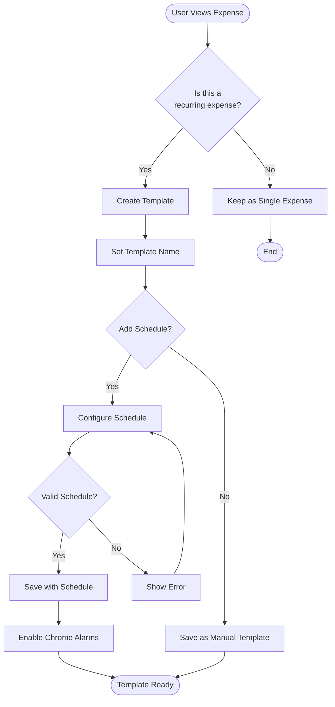
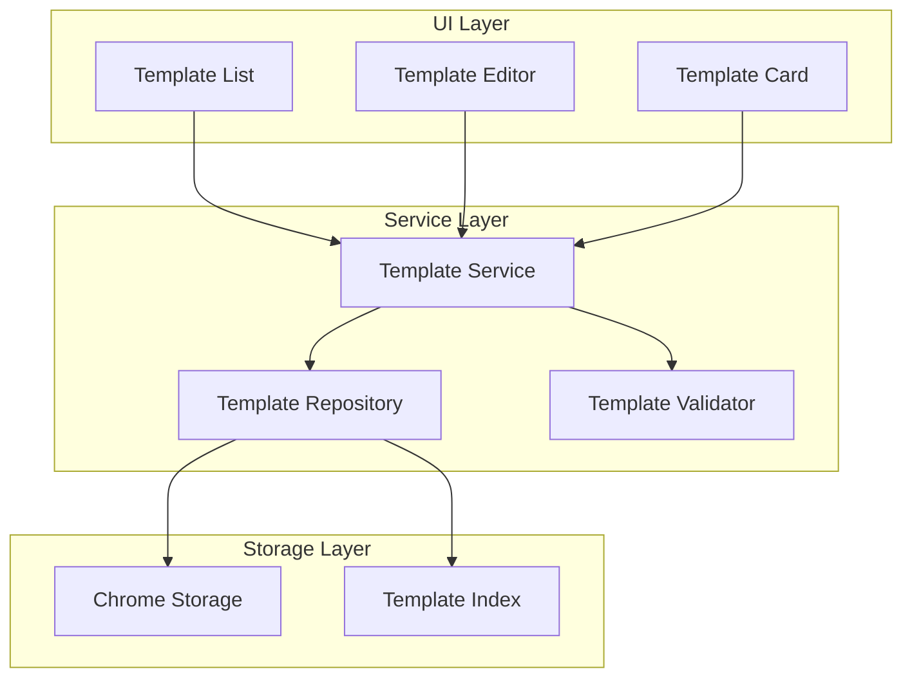
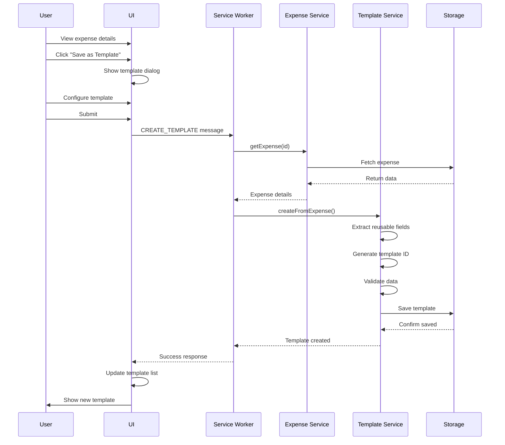
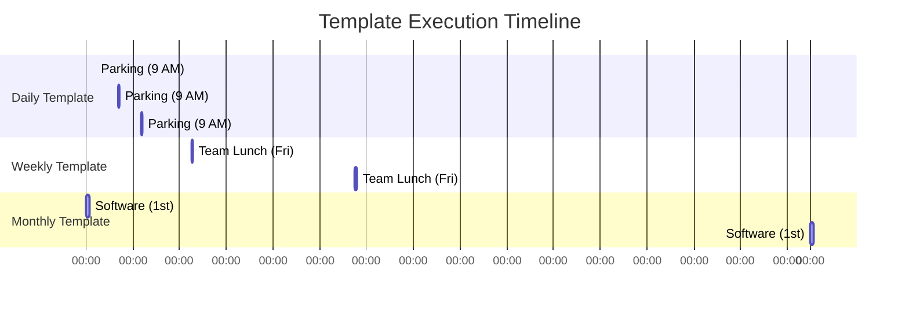
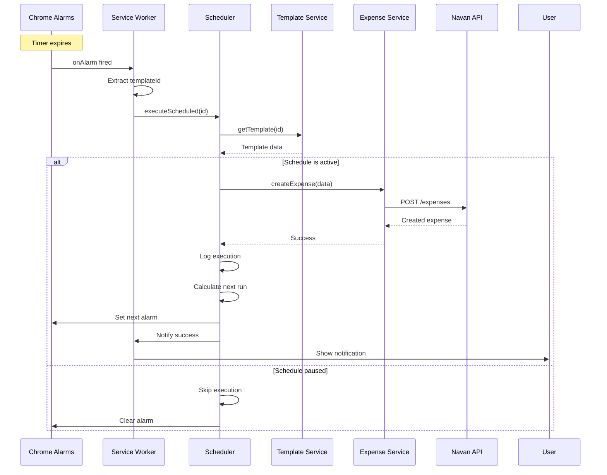

# EXPENSABL

An expense management automation tool living right in your browser.

## Dev Notes

### Getting Started

#### Prerequisites

- Node.js (v16 or higher)
- npm (v7 or higher)
- Google Chrome browser

#### Installation & Build

```bash
# clone and install
git clone https://github.com/xtendabl/expensabl.git
cd expensabl && npm install

# build for development (includes source maps)
npm run build:dev

# build for production (optimized)
npm run build

# run tests
npm test

# run tests in watch mode
npm run test:watch

# fix eslint issues
npm run lint:fix

# fix formatting
npm run format:fix
```

#### Testing in Chrome

After building the extension, follow these steps to test it in Chrome:

1. **Open Chrome Extension Management**
    - Navigate to `chrome://extensions/` in your Chrome browser
    - Or click the puzzle icon in the toolbar → "Manage Extensions"

2. **Enable Developer Mode**
    - Toggle the "Developer mode" switch in the top right corner

3. **Load the Extension**
    - Click "Load unpacked" button
    - Navigate to your `expensabl/dist` directory
    - Select the folder and click "Open"

4. **Verify Installation**
    - The extension should appear in your extensions list
    - Look for the Expensabl icon in your Chrome toolbar
    - If not visible, click the puzzle icon and pin Expensabl

5. **Test the Extension**
    - Click the Expensabl icon to open the sidepanel
    - The extension is now ready to use
    - Check the Chrome DevTools console for any errors

#### Development Workflow

1. **Make Changes**: Edit source files in the `src/` directory
2. **Rebuild**: Run `npm run build:dev` to rebuild with your changes
3. **Reload Extension**:
    - Go to `chrome://extensions/`
    - Find Expensabl and click the refresh icon
    - Or use the keyboard shortcut `Cmd+R` (Mac) / `Ctrl+R` (Windows/Linux) on the extensions page
4. **Test Changes**: Open the extension and verify your changes

#### Debugging Tips

- **Background Service Worker**:
    - Click "Inspect views: service worker" on the extension card in `chrome://extensions/`
    - This opens DevTools for background script debugging

- **Sidepanel/Popup**:
    - Right-click the extension sidepanel and select "Inspect"
    - This opens DevTools for the UI debugging

- **Content Scripts**:
    - Open DevTools on any webpage where the extension is active
    - Content script logs appear in the page's console

## Project Structure

### Chrome Extension Layer (`src/chrome/`)

The Chrome extension layer serves as the primary interface between users and the expense management system. It handles
all UI rendering, user interactions, and communication with Chrome's extension APIs.

| Directory         | Purpose                    | How It Fits Into The System                                                                                                                                                                                                                                                                     |
|-------------------|----------------------------|-------------------------------------------------------------------------------------------------------------------------------------------------------------------------------------------------------------------------------------------------------------------------------------------------|
| components/       | Reusable UI components     | Provides the building blocks for the extension's user interface, implementing a component-based architecture that ensures consistent look and feel across all views. These components handle user interactions and communicate with the background service worker through the messaging system. |
| domains/expenses/ | Expense-specific UI domain | Acts as the presentation layer for expense management, maintaining local UI state and orchestrating the display of expense data. It bridges the gap between raw expense data from the features layer and the visual components users interact with.                                             |
| shared/           | Shared UI services         | Provides critical infrastructure for UI operations including state management for reactive updates and a messaging facade that abstracts Chrome's extension messaging API. This layer ensures UI components can communicate with background services without knowing implementation details.    |
| builders/         | UI content builders        | Dynamically generates UI content based on user context and application state, reducing the need for static templates. This approach allows for more flexible and maintainable UI generation, particularly for help content and dynamic forms.                                                   |
| *Root files*      | Extension entry points     | These files serve as the primary integration points with Chrome's extension APIs. The service worker handles background tasks and API calls, the content script injects functionality into web pages, and the sidepanel provides the main user interface for expense management.                |

### Features - Core Business Logic (`src/features/`)

The features directory implements Domain-Driven Design principles, organizing code by business capability rather than
technical layers. Each subdomain encapsulates its complete business logic, making the system more maintainable and
scalable.

| Directory  | Purpose                   | How It Fits Into The System                                                                                                                                                                                                                                                                     |
|------------|---------------------------|-------------------------------------------------------------------------------------------------------------------------------------------------------------------------------------------------------------------------------------------------------------------------------------------------|
| auth/      | Authentication management | Manages the complete authentication lifecycle including token storage, validation, and refresh. It ensures secure access to the expense API and maintains user sessions across browser restarts, acting as the gatekeeper for all authenticated operations.                                     |
| expenses/  | Expense domain logic      | The heart of the application's business logic, handling all expense-related operations from creation to submission. It includes sophisticated data transformation layers, retry mechanisms for network failures, and maintains consistency between local and remote expense data.               |
| messaging/ | Message routing system    | Implements a robust message-based architecture that enables communication between different extension contexts (content script, service worker, sidepanel). It uses a handler pattern with type safety to ensure reliable command execution and response handling across the extension.         |
| templates/ | Template management       | Enables expense automation through reusable templates with sophisticated scheduling capabilities. This module handles complex time calculations, validates scheduling rules, and integrates with the expense creation system to automatically generate expenses based on user-defined patterns. |

### Shared Services (`src/shared/`)

The shared services layer provides cross-cutting concerns and utilities used throughout the application. These services
abstract complex operations and provide consistent interfaces for common functionality.

| Directory         | Purpose                 | How It Fits Into The System                                                                                                                                                                                                                                  |
|-------------------|-------------------------|--------------------------------------------------------------------------------------------------------------------------------------------------------------------------------------------------------------------------------------------------------------|
| services/logger/  | Logging infrastructure  | Provides environment-aware logging that adapts between development and production modes. It integrates with Chrome's storage API to persist logs for debugging while respecting performance constraints, making it easier to diagnose issues in production.  |
| services/storage/ | Storage abstraction     | Abstracts Chrome's storage APIs behind a consistent interface, supporting both synchronous and asynchronous operations. It includes transaction support for atomic updates and caching mechanisms to improve performance while maintaining data consistency. |
| types/            | Common type definitions | Establishes the contract between different parts of the system through shared TypeScript interfaces. This ensures type safety across module boundaries and makes refactoring safer by catching breaking changes at compile time.                             |

### Public Assets (`public/`)

Contains all static resources required by the Chrome extension, including visual assets and the manifest that defines
the extension's capabilities.

| Directory/File | Purpose                   | How It Fits Into The System                                                                                                                                                                                                 |
|----------------|---------------------------|-----------------------------------------------------------------------------------------------------------------------------------------------------------------------------------------------------------------------------|
| icons/         | Extension icons           | Provides visual identity for the extension across different Chrome UI surfaces, following Google's design guidelines for extensions. Multiple sizes ensure crisp display on various screen densities.                       |
| manifest.json  | Chrome extension manifest | Defines the extension's capabilities, permissions, and integration points with Chrome. This configuration determines what APIs the extension can access and how it appears to users in the Chrome Web Store and browser UI. |

### Documentation (`docs/`)

Project documentation that helps maintain consistency and knowledge sharing across the development team.

| Content    | Purpose             | How It Fits Into The System                                                                                                                                                                                     |
|------------|---------------------|-----------------------------------------------------------------------------------------------------------------------------------------------------------------------------------------------------------------|
| *.md files | Documentation files | Contains architectural decisions, API documentation, and development guides that help maintain consistency as the team grows. Good documentation here reduces onboarding time and prevents architectural drift. |

### Configuration Files

Root-level configuration files that define how the project is built, tested, and maintained.

| File              | Purpose                  | How It Fits Into The System                                                                                                                                                                                                         |
|-------------------|--------------------------|-------------------------------------------------------------------------------------------------------------------------------------------------------------------------------------------------------------------------------------|
| webpack.config.js | Build configuration      | Orchestrates the build process, handling TypeScript compilation, code splitting for different extension contexts, and optimization for production. It ensures the extension loads quickly while maintaining development ergonomics. |
| jest.config.js    | Test configuration       | Configures the testing environment to work with Chrome extension APIs and TypeScript. It sets up mocks for browser APIs and ensures tests run in an environment that closely matches the extension's runtime.                       |
| tsconfig.json     | TypeScript configuration | Defines compilation rules and module resolution strategies that enable clean imports and strong type checking. The path aliases defined here improve code organization and make imports more maintainable.                          |
| package.json      | Dependencies and scripts | Central configuration for the project's dependencies and automation scripts. It defines the project's external dependencies carefully chosen for bundle size and compatibility with the extension environment.                      |

## Core Activities

### Quick Reference

| Activity            | Trigger                         | Key Components                 | Chrome APIs Used               |
|---------------------|---------------------------------|--------------------------------|--------------------------------|
| Token Interception  | User login to Navan             | Content Script, Service Worker | webRequest, storage            |
| Expense Creation    | Template selection/Manual entry | UI Components, Expense Service | storage, runtime               |
| Scheduled Execution | Chrome alarms                   | Scheduler, Template Service    | alarms, storage, notifications |

| Activity            | Prerequisites                   | Data Flow                                      | Storage Output                       |
|---------------------|---------------------------------|------------------------------------------------|--------------------------------------|
| Token Interception  | Active Navan session            | HTTP Headers → Content Script → Service Worker | Encrypted auth token                 |
| Expense Creation    | Valid auth token, Template data | UI → Message Router → API → Storage            | Expense record, Template usage stats |
| Scheduled Execution | Active template with schedule   | Alarm → Service Worker → API                   | Execution history, Created expense   |

### Token Interception

The extension automatically captures authentication tokens when users log into Navan, eliminating the need for manual
credential entry. This foundational activity enables all other features by establishing secure API access. The content
script monitors network requests on Navan domains using multiple strategies to ensure reliable token capture. Once
captured, tokens are encrypted and stored securely in Chrome's local storage for subsequent API calls.

#### Token Capture Architecture



The token capture system employs a multi-layered approach with fallback mechanisms. Network interception occurs at
multiple levels to handle different authentication patterns. The system validates captured tokens before storage and
implements automatic refresh detection to maintain current authentication state.

#### Token Capture Implementation

```typescript
// Content script token interception
const interceptor = {
    captureFromFetch: () => {
        const originalFetch = window.fetch;
        window.fetch = async (...args) => {
            const response = await originalFetch(...args);
            const authHeader = args[1]?.headers?.['Authorization'];
            if (authHeader?.startsWith('Bearer ')) {
                chrome.runtime.sendMessage({
                    type: 'TOKEN_CAPTURED',
                    token: authHeader.substring(7),
                    source: 'fetch'
                });
            }
            return response;
        };
    }
};
```

#### Token Interception Sequence



### Expenses and Templates

The expense and template system forms the core of user interaction, enabling both one-time expense creation and reusable
template management. Users can quickly create expenses from saved templates or convert existing expenses into templates
for future use. This bi-directional workflow significantly reduces data entry time and ensures consistency across
similar expenses. The system maintains full compatibility with Navan's expense categories, merchants, and approval
workflows.

#### Template Creation Decision Flow



Templates store essential expense information while removing transaction-specific details. The template service manages
the lifecycle of templates including creation, updates, and deletion. Each template maintains usage statistics and
execution history to help users track their expense automation effectiveness.

#### Template Data Structure

```typescript
interface ExpenseTemplate {
    id: string;
    name: string;
    description?: string;
    expenseData: {
        merchant: string;
        amount: number;
        currency: string;
        category: string;
        project?: string;
        notes?: string;
    };
    metadata: {
        createdAt: string;
        lastUsed?: string;
        usageCount: number;
        isFavorite: boolean;
    };
    schedule?: {
        enabled: boolean;
        frequency: 'daily' | 'weekly' | 'monthly' | 'custom';
        nextExecution?: string;
    };
}
```

#### Template System Components



The template repository implements efficient indexing for fast retrieval and search operations. Templates are versioned
to support future compatibility and migration scenarios. The validation service ensures template data integrity and
prevents creation of invalid expense configurations.

#### Expense to Template Conversion



#### Real-World Use Cases

**1. Weekly Team Lunch Template**

```
Name: "Friday Team Lunch"
Merchant: "Local Bistro"
Amount: $125.00
Category: "Meals - Team"
Schedule: Weekly (Fridays)
Notes: "Weekly team building lunch"
```

**2. Monthly Software Subscription**

```
Name: "Design Software License"
Merchant: "Adobe Creative Cloud"
Amount: $52.99
Category: "Software - Subscription"
Schedule: Monthly (1st of month)
Project: "Marketing Dept"
```

**3. Client Entertainment Template**

```
Name: "Client Dinner Template"
Merchant: "[To be filled]"
Amount: $200.00
Category: "Entertainment - Client"
Schedule: Manual (no automation)
Notes: "Standard client dinner budget"
```

### Scheduled Executions

Scheduled executions transform manual expense entry into an automated workflow, leveraging Chrome's alarm API to create
expenses at predetermined intervals. This feature is particularly valuable for predictable, recurring expenses that
follow consistent patterns. The scheduler supports daily, weekly, monthly, and custom interval patterns while
maintaining flexibility for users to pause or modify schedules. The system includes comprehensive error handling and
retry logic to ensure reliable execution even when network conditions are suboptimal.

#### Scheduling Timeline Patterns



The scheduling engine calculates optimal execution times based on user timezone and system load. Chrome alarms persist
across browser restarts, ensuring scheduled executions continue reliably. The system monitors execution history to
detect and alert on repeated failures that might indicate configuration issues.

#### Chrome Alarm Configuration

```typescript
// Scheduler implementation for template execution
class TemplateScheduler {
    async scheduleTemplate(template: Template): Promise<void> {
        const alarmName = `template_${template.id}`;
        const schedule = template.schedule;

        if (!schedule?.enabled) {
            await chrome.alarms.clear(alarmName);
            return;
        }

        const alarmInfo: chrome.alarms.AlarmCreateInfo = {
            when: this.calculateNextExecution(schedule),
            periodInMinutes: this.getPeriodMinutes(schedule.frequency)
        };

        await chrome.alarms.create(alarmName, alarmInfo);

        // Store alarm metadata for recovery
        await this.storage.set(`alarm_${alarmName}`, {
            templateId: template.id,
            created: new Date().toISOString(),
            nextExecution: new Date(alarmInfo.when).toISOString()
        });
    }
}
```

#### Scheduled Execution Sequence



#### Real-World Use Cases

**1. Daily Parking Expense**

```
Template: "Office Parking"
Amount: $15.00
Schedule: Daily (Weekdays only)
Time: 9:00 AM
Auto-submit: Yes
Note: Automatically creates parking expenses for work days
```

**2. Bi-weekly Client Dinner**

```
Template: "Client Entertainment - Dinner"
Amount: $250.00
Schedule: Every 2 weeks (Thursday)
Time: 6:00 PM
Auto-submit: No (requires receipt)
Note: Reminder for regular client relationship building

## Appendix: JSON Data Structures Reference

This section provides a comprehensive reference for all JSON data structures used in the Expensabl Chrome extension, with examples of actual objects and their relationships.

### Table of Contents

1. [Expense Data Structures](#expense-data-structures)
2. [Template Data Structures](#template-data-structures)
3. [Authentication Structures](#authentication-structures)
4. [Message Types](#message-types)
5. [Storage Structures](#storage-structures)
6. [Error Structures](#error-structures)

### Expense Data Structures

#### ExpenseCreatePayload - Request to Create New Expense

```json
{
  "merchant": "Office Depot",
  "amount": 45.99,
  "currency": "USD",
  "date": "2025-08-01",
  "policy": "OFFICE_SUPPLIES",
  "description": "Printer paper and pens for Q3",
  "project": "Marketing-2025",
  "customFields": {
    "costCenter": "MKT-100",
    "clientCode": "INTERNAL"
  }
}
```

#### Expense - Full Expense Object

```json
{
  "uuid": "a1b2c3d4-e5f6-7890-abcd-ef1234567890",
  "dateCreated": "2025-08-01T14:30:00.000Z",
  "dateModified": "2025-08-01T14:45:00.000Z",
  "dateSubmitted": null,
  "dateApproved": null,
  "status": "DRAFT",
  "source": "MANUAL",
  "user": {
    "uuid": "user-123",
    "email": "user@company.com",
    "givenName": "John",
    "familyName": "Doe",
    "fullName": "John Doe"
  },
  "merchant": {
    "uuid": "merchant-456",
    "name": "Office Depot",
    "category": "office_supplies_and_stationery",
    "categoryGroup": "OFFICE_SUPPLIES",
    "logo": "https://example.com/logos/office-depot.png"
  },
  "amount": 45.99,
  "currency": "USD",
  "accountAmount": 45.99,
  "accountCurrency": "USD",
  "merchantAmount": 45.99,
  "merchantCurrency": "USD",
  "date": "2025-08-01",
  "instant": "2025-08-01T14:30:00.000Z",
  "policy": "OFFICE_SUPPLIES",
  "policyName": "Office Supplies",
  "details": {
    "description": "Printer paper and pens for Q3",
    "project": "Marketing-2025",
    "participants": ["user-123"],
    "customFieldValues": [
      {
        "fieldId": "field-1",
        "fieldName": "Cost Center",
        "value": "MKT-100"
      }
    ],
    "glCode": {
      "uuid": "gl-789",
      "number": "6100",
      "name": "Office Supplies"
    }
  },
  "receiptRequired": false,
  "receiptKey": null,
  "flagged": false,
  "flag": {
    "status": null,
    "reasons": {},
    "reasonList": []
  },
  "reimbursementMethod": "PAYROLL",
  "reportingData": {
    "department": "Marketing",
    "billTo": "Corporate",
    "region": "North America"
  }
}
```

#### ExpenseListResponse - Paginated Expense List

```json
{
  "expenses": [
    {
      "uuid": "expense-1",
      "merchant": "Starbucks",
      "amount": 12.50,
      "date": "2025-08-01",
      "status": "APPROVED"
    },
    {
      "uuid": "expense-2", 
      "merchant": "Uber",
      "amount": 28.75,
      "date": "2025-07-31",
      "status": "PENDING"
    }
  ],
  "total": 156,
  "page": 1,
  "pageSize": 20,
  "hasMore": true
}
```

#### SearchTransaction - Search Result Item

```json
{
  "uuid": "txn-123",
  "type": "expense",
  "merchantName": "Amazon",
  "amount": 89.99,
  "currency": "USD",
  "date": "2025-08-01",
  "status": "DRAFT",
  "policyName": "Technology",
  "description": "USB-C adapters",
  "highlightedFields": {
    "merchantName": "<em>Amazon</em> Web Services"
  }
}
```

### Template Data Structures

#### ExpenseTemplate - Complete Template Object

```json
{
  "id": "template-123",
  "name": "Monthly Phone Bill",
  "description": "Verizon monthly service charge",
  "createdAt": "2025-07-01T10:00:00.000Z",
  "lastModified": "2025-08-01T14:30:00.000Z",
  "metadata": {
    "usageCount": 7,
    "lastUsed": "2025-08-01T09:00:00.000Z",
    "isFavorite": true,
    "tags": ["recurring", "utilities"],
    "version": 1
  },
  "expenseData": {
    "merchant": "Verizon",
    "amount": 85.00,
    "currency": "USD",
    "policy": "PHONE",
    "description": "Phone service - {month} {year}",
    "project": "Operations",
    "categoryGroup": "PHONE"
  },
  "scheduling": {
    "enabled": true,
    "frequency": "monthly",
    "interval": 1,
    "dayOfMonth": 15,
    "startTime": "09:00",
    "timezone": "America/New_York",
    "nextExecution": "2025-09-15T13:00:00.000Z",
    "endDate": null
  },
  "executionHistory": [
    {
      "id": "exec-456",
      "executedAt": "2025-08-15T13:00:05.000Z",
      "success": true,
      "expenseId": "expense-789",
      "error": null,
      "duration": 1250
    }
  ]
}
```

#### CreateTemplateRequest

```json
{
  "name": "Client Lunch Template",
  "description": "Standard client lunch expense",
  "expenseData": {
    "merchant": "Restaurant (Variable)",
    "amount": 75.00,
    "currency": "USD",
    "policy": "MEALS_CLIENT",
    "description": "Client lunch - {client_name}"
  },
  "isFavorite": false
}
```

#### TemplateExecution - Execution History Entry

```json
{
  "id": "exec-123",
  "templateId": "template-456",
  "executedAt": "2025-08-01T12:00:00.000Z",
  "success": true,
  "expenseId": "expense-789",
  "expenseData": {
    "merchant": "Verizon",
    "amount": 85.00,
    "description": "Phone service - August 2025"
  },
  "error": null,
  "duration": 1523,
  "retryCount": 0
}
```

### Authentication Structures

#### TokenData - Stored Authentication Token

```json
{
  "token": "Bearer eyJhbGciOiJIUzI1NiIsInR5cCI6IkpXVCJ9...",
  "expiresAt": 1753396268728,
  "refreshToken": "refresh_token_value",
  "tokenType": "Bearer",
  "scope": "expenses:read expenses:write",
  "metadata": {
    "userId": "user-123",
    "companyId": "company-456",
    "capturedAt": "2025-08-01T10:00:00.000Z",
    "source": "login",
    "lastValidated": "2025-08-01T14:00:00.000Z"
  }
}
```

### Message Types

#### BackgroundMessage Examples

**Token Captured Message**
```json
{
  "action": "TOKEN_CAPTURED",
  "data": {
    "token": "Bearer eyJhbGciOiJIUzI1NiIs...",
    "source": "fetch",
    "timestamp": 1753309868728
  }
}
```

**Create Expense Message**
```json
{
  "action": "CREATE_EXPENSE",
  "data": {
    "merchant": "Uber",
    "amount": 28.50,
    "currency": "USD",
    "date": "2025-08-01",
    "policy": "TRANSPORTATION"
  }
}
```

**Execute Template Message**
```json
{
  "action": "EXECUTE_TEMPLATE",
  "data": {
    "templateId": "template-123",
    "variables": {
      "month": "August",
      "year": "2025"
    }
  }
}
```

#### MessageResponse

```json
{
  "success": true,
  "data": {
    "expenseId": "expense-123",
    "status": "CREATED"
  },
  "error": null,
  "timestamp": 1753309868728
}
```

### Storage Structures

#### Storage Keys and Data Types

| Key | Type | Example Data |
|-----|------|--------------|
| `auth_token` | TokenData | See TokenData structure above |
| `templates` | Map<string, ExpenseTemplate> | Template objects indexed by ID |
| `recent_expenses` | Expense[] | Array of recent expense objects |
| `user_preferences` | Object | `{"theme": "light", "notifications": true}` |
| `execution_log` | TemplateExecution[] | Array of execution history |
| `pending_schedules` | Object | `{"template-123": "2025-09-15T13:00:00.000Z"}` |

#### Transaction Storage Example

```json
{
  "transactionId": "txn-789",
  "operations": [
    {
      "type": "set",
      "key": "template-123",
      "value": { "...template data..." },
      "timestamp": 1753309868728
    },
    {
      "type": "remove",
      "key": "template-old",
      "timestamp": 1753309868729
    }
  ],
  "status": "pending",
  "createdAt": "2025-08-01T14:30:00.000Z"
}
```

### Error Structures

#### ApiError Response

```json
{
  "error": {
    "code": "VALIDATION_ERROR",
    "message": "Invalid expense data",
    "details": {
      "field": "amount",
      "reason": "Amount must be greater than 0"
    },
    "timestamp": "2025-08-01T14:30:00.000Z",
    "requestId": "req-123"
  }
}
```

#### TemplateError

```json
{
  "code": "TEMPLATE_NOT_FOUND",
  "message": "Template with ID 'template-999' not found",
  "templateId": "template-999",
  "timestamp": "2025-08-01T14:30:00.000Z"
}
```

### Chrome Alarm Metadata

```json
{
  "alarm_template_123": {
    "templateId": "template-123",
    "created": "2025-08-01T10:00:00.000Z",
    "nextExecution": "2025-09-15T13:00:00.000Z",
    "frequency": "monthly",
    "retryCount": 0,
    "lastError": null
  }
}
```

### Policy and Validation Structures

#### PolicyDescription

```json
{
  "type": "MEALS_CLIENT",
  "name": "Client Meals",
  "description": "Meals with clients and prospects",
  "picture": "https://example.com/icons/meals.png",
  "warningAmounts": {
    "DAILY": {
      "USD": 150,
      "EUR": 130,
      "GBP": 120
    }
  },
  "requiresReceipt": true,
  "requiresParticipants": true,
  "glCodeRequired": true
}
```

### Custom Field Structures

```json
{
  "customFields": [
    {
      "id": "field-1",
      "name": "Cost Center",
      "type": "select",
      "required": true,
      "options": ["MKT-100", "ENG-200", "OPS-300"],
      "value": "MKT-100"
    },
    {
      "id": "field-2",
      "name": "Project Code",
      "type": "text",
      "required": false,
      "value": "PROJ-2025-08"
    }
  ]
}
```

---