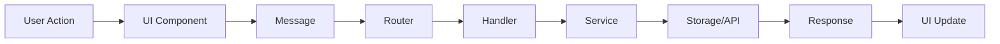
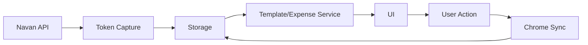

# Project Structure

This guide provides a comprehensive overview of the Expensabl project structure, explaining how different components fit together to create a cohesive Chrome extension.

## Directory Overview

```
expensabl/
├── src/                    # Source code
│   ├── chrome/            # Chrome extension layer
│   ├── features/          # Core business logic
│   └── shared/            # Shared services and utilities
├── public/                # Static assets
├── docs/                  # Documentation
├── dist/                  # Build output (generated)
├── tests/                 # Test files
└── [config files]         # Configuration files
```

## Chrome Extension Layer (`src/chrome/`)

The Chrome extension layer serves as the primary interface between users and the expense management system. It handles all UI rendering, user interactions, and communication with Chrome's extension APIs.

| Directory         | Purpose                    | How It Fits Into The System                                                                                                                                                                                                                                                                     |
|-------------------|----------------------------|-------------------------------------------------------------------------------------------------------------------------------------------------------------------------------------------------------------------------------------------------------------------------------------------------|
| components/       | Reusable UI components     | Provides the building blocks for the extension's user interface, implementing a component-based architecture that ensures consistent look and feel across all views. These components handle user interactions and communicate with the background service worker through the messaging system. |
| domains/expenses/ | Expense-specific UI domain | Acts as the presentation layer for expense management, maintaining local UI state and orchestrating the display of expense data. It bridges the gap between raw expense data from the features layer and the visual components users interact with.                                             |
| shared/           | Shared UI services         | Provides critical infrastructure for UI operations including state management for reactive updates and a messaging facade that abstracts Chrome's extension messaging API. This layer ensures UI components can communicate with background services without knowing implementation details.    |
| builders/         | UI content builders        | Dynamically generates UI content based on user context and application state, reducing the need for static templates. This approach allows for more flexible and maintainable UI generation, particularly for help content and dynamic forms.                                                   |
| *Root files*      | Extension entry points     | These files serve as the primary integration points with Chrome's extension APIs. The service worker handles background tasks and API calls, the content script injects functionality into web pages, and the sidepanel provides the main user interface for expense management.                |

### Key Files in Chrome Layer

- **service-worker.ts**: Background script handling message routing and token capture
- **content.ts**: Injected into Navan pages for token interception
- **sidepanel.ts**: Main UI entry point for the side panel
- **message-adapter.ts**: Type-safe messaging wrapper

## Features - Core Business Logic (`src/features/`)

The features directory implements Domain-Driven Design principles, organizing code by business capability rather than technical layers. Each subdomain encapsulates its complete business logic, making the system more maintainable and scalable.

| Directory  | Purpose                   | How It Fits Into The System                                                                                                                                                                                                                                                                     |
|------------|---------------------------|-------------------------------------------------------------------------------------------------------------------------------------------------------------------------------------------------------------------------------------------------------------------------------------------------|
| auth/      | Authentication management | Manages the complete authentication lifecycle including token storage, validation, and refresh. It ensures secure access to the expense API and maintains user sessions across browser restarts, acting as the gatekeeper for all authenticated operations.                                     |
| expenses/  | Expense domain logic      | The heart of the application's business logic, handling all expense-related operations from creation to submission. It includes sophisticated data transformation layers, retry mechanisms for network failures, and maintains consistency between local and remote expense data.               |
| messaging/ | Message routing system    | Implements a robust message-based architecture that enables communication between different extension contexts (content script, service worker, sidepanel). It uses a handler pattern with type safety to ensure reliable command execution and response handling across the extension.         |
| templates/ | Template management       | Enables expense automation through reusable templates with sophisticated scheduling capabilities. This module handles complex time calculations, validates scheduling rules, and integrates with the expense creation system to automatically generate expenses based on user-defined patterns. |

### Feature Module Structure

Each feature module typically contains:
- **types.ts**: TypeScript interfaces and types
- **service.ts**: Business logic implementation
- **repository.ts**: Data access layer
- **handlers/**: Message handlers for the module
- **utils.ts**: Helper functions specific to the feature

## Shared Services (`src/shared/`)

The shared services layer provides cross-cutting concerns and utilities used throughout the application. These services abstract complex operations and provide consistent interfaces for common functionality.

| Directory         | Purpose                 | How It Fits Into The System                                                                                                                                                                                                                                  |
|-------------------|-------------------------|--------------------------------------------------------------------------------------------------------------------------------------------------------------------------------------------------------------------------------------------------------------|
| services/logger/  | Logging infrastructure  | Provides environment-aware logging that adapts between development and production modes. It integrates with Chrome's storage API to persist logs for debugging while respecting performance constraints, making it easier to diagnose issues in production.  |
| services/storage/ | Storage abstraction     | Abstracts Chrome's storage APIs behind a consistent interface, supporting both synchronous and asynchronous operations. It includes transaction support for atomic updates and caching mechanisms to improve performance while maintaining data consistency. |
| types/            | Common type definitions | Establishes the contract between different parts of the system through shared TypeScript interfaces. This ensures type safety across module boundaries and makes refactoring safer by catching breaking changes at compile time.                             |

### Shared Service Patterns

- **Singleton Pattern**: Services export pre-configured instances
- **Adapter Pattern**: Abstract Chrome APIs behind consistent interfaces
- **Factory Pattern**: Create context-specific service instances

## Public Assets (`public/`)

Contains all static resources required by the Chrome extension, including visual assets and the manifest that defines the extension's capabilities.

| Directory/File | Purpose                   | How It Fits Into The System                                                                                                                                                                                                 |
|----------------|---------------------------|-----------------------------------------------------------------------------------------------------------------------------------------------------------------------------------------------------------------------------|
| icons/         | Extension icons           | Provides visual identity for the extension across different Chrome UI surfaces, following Google's design guidelines for extensions. Multiple sizes ensure crisp display on various screen densities.                       |
| manifest.json  | Chrome extension manifest | Defines the extension's capabilities, permissions, and integration points with Chrome. This configuration determines what APIs the extension can access and how it appears to users in the Chrome Web Store and browser UI. |

### Manifest V3 Permissions

Key permissions required:
- **storage**: Store user data and preferences
- **tabs**: Access tab information
- **activeTab**: Interact with active tab
- **sidePanel**: Display side panel UI
- **webRequest**: Monitor network requests
- **notifications**: Show system notifications
- **alarms**: Schedule recurring tasks
- **host permission**: `https://app.navan.com/*`

## Documentation (`docs/`)

Project documentation that helps maintain consistency and knowledge sharing across the development team.

| Content    | Purpose             | How It Fits Into The System                                                                                                                                                                                     |
|------------|---------------------|-----------------------------------------------------------------------------------------------------------------------------------------------------------------------------------------------------------------|
| src/       | Source documentation | Contains the mdBook source files including guides, API references, and architectural documentation. These files are compiled into the static documentation site.                                                |
| book/      | Built documentation  | The compiled static site generated from the source files. This can be served locally or deployed to GitHub Pages for easy access by team members and users.                                                    |

## Configuration Files

Root-level configuration files that define how the project is built, tested, and maintained.

| File              | Purpose                  | How It Fits Into The System                                                                                                                                                                                                         |
|-------------------|--------------------------|-------------------------------------------------------------------------------------------------------------------------------------------------------------------------------------------------------------------------------------|
| webpack.config.js | Build configuration      | Orchestrates the build process, handling TypeScript compilation, code splitting for different extension contexts, and optimization for production. It ensures the extension loads quickly while maintaining development ergonomics. |
| jest.config.js    | Test configuration       | Configures the testing environment to work with Chrome extension APIs and TypeScript. It sets up mocks for browser APIs and ensures tests run in an environment that closely matches the extension's runtime.                       |
| tsconfig.json     | TypeScript configuration | Defines compilation rules and module resolution strategies that enable clean imports and strong type checking. The path aliases defined here improve code organization and make imports more maintainable.                          |
| package.json      | Dependencies and scripts | Central configuration for the project's dependencies and automation scripts. It defines the project's external dependencies carefully chosen for bundle size and compatibility with the extension environment.                      |

## Build Output (`dist/`)

Generated during the build process, this directory contains:
- **manifest.json**: Processed extension manifest
- **service-worker.js**: Bundled background script
- **content.js**: Bundled content script
- **sidepanel.html**: Side panel HTML entry
- **sidepanel.js**: Bundled side panel code
- **assets/**: Icons and other static resources

## Development Patterns

### Message Flow



### Data Flow



### Module Dependencies
- UI layer depends on features and shared services
- Features depend on shared services
- Shared services have no dependencies on other layers
- All layers use shared types

## Best Practices

### Code Organization
1. Keep related code together in feature modules
2. Use index.ts files for clean exports
3. Separate types from implementation
4. Follow consistent naming conventions

### Dependency Management
1. Minimize external dependencies
2. Use path aliases for clean imports
3. Avoid circular dependencies
4. Keep bundle size small

### Testing Structure
1. Mirror source structure in tests
2. Unit tests next to source files
3. Integration tests in separate directory
4. Mock Chrome APIs consistently

### Documentation
1. Keep docs close to code
2. Update docs with code changes
3. Use JSDoc for complex functions
4. Maintain architectural decision records