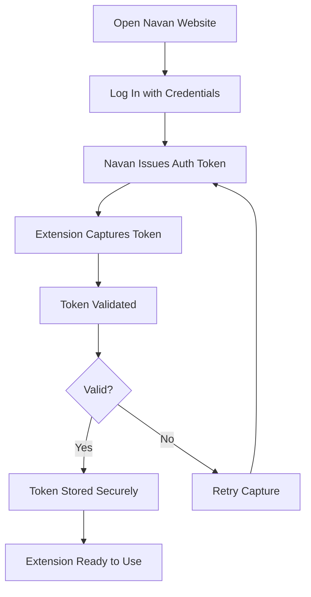

# Authentication

This guide explains how Expensabl handles authentication with Navan, including automatic token capture, secure storage, validation, and troubleshooting common issues.

## Quick Reference

| Feature | Description | Status Indicator |
|---------|-------------|------------------|
| Automatic Token Capture | Captures tokens when you log into Navan | Green checkmark in extension |
| Token Validation | Verifies tokens are valid and not expired | "Authentication valid" message |
| Secure Storage | Encrypts and stores tokens locally | Lock icon in settings |
| Auto-Refresh | Automatically updates tokens when refreshed | Seamless background operation |

## How Authentication Works

Expensabl uses a seamless, automatic authentication system that captures your Navan session tokens when you log in, eliminating the need to enter credentials in the extension.

### Authentication Flow

## Getting Started

### Initial Setup

1. **Install the Extension**: Add Expensabl to Chrome from the Chrome Web Store
2. **Open Navan**: Navigate to [app.navan.com](https://app.navan.com) in your browser
3. **Log In**: Sign in with your Navan credentials
4. **Automatic Capture**: The extension automatically captures your authentication token
5. **Confirmation**: You'll see a brief notification confirming successful authentication

### Checking Authentication Status

To verify your authentication status:

1. Open the Expensabl side panel (click the extension icon)
2. Click "Fetch Expenses" or any action button
3. Look for the authentication status:
   - ✅ **Authenticated**: You can use all features
   - ❌ **Not Authenticated**: You need to log into Navan

## Token Management

### Automatic Token Capture

The extension automatically captures tokens through multiple methods:

- **Web Request Monitoring**: Intercepts authorization headers from Navan API calls
- **Content Script Detection**: Monitors page activity for authentication events
- **Cookie Analysis**: Reads session cookies when available
- **Storage Sync**: Synchronizes tokens across extension components

### Token Storage & Security

Your authentication tokens are:

- **Locally Stored**: Never sent to external servers
- **Encrypted**: Protected using Chrome's built-in security
- **Session-Based**: Automatically cleared when you log out of Navan
- **Isolated**: Stored separately from other extension data

### Token Refresh

Tokens are automatically refreshed when:

- You log back into Navan after session expiry
- Navan refreshes your session in the background
- You navigate to different Navan pages
- The extension detects token expiration

## Troubleshooting

### Common Issues and Solutions

#### "Authentication Required" Message

**Problem**: The extension shows "Authentication Required" when trying to fetch expenses.

**Solutions**:
1. Open [app.navan.com](https://app.navan.com) in a browser tab
2. Log in with your credentials
3. Wait 2-3 seconds for token capture
4. Try the action again in the extension

#### Token Not Capturing

**Problem**: You're logged into Navan but the extension doesn't capture the token.

**Solutions**:
1. **Refresh the Navan page**: Press F5 or Cmd+R while on app.navan.com
2. **Check permissions**: Ensure the extension has permission to access app.navan.com
3. **Clear and re-login**:
   - Log out of Navan completely
   - Clear browser cache for app.navan.com
   - Log in again
4. **Reload the extension**:
   - Go to chrome://extensions
   - Find Expensabl
   - Click the refresh icon

#### Intermittent Authentication Failures

**Problem**: Authentication works sometimes but fails randomly.

**Solutions**:
1. **Check network stability**: Ensure stable internet connection
2. **Verify Navan session**: Your Navan session may have expired
3. **Check for multiple tabs**: Close duplicate Navan tabs
4. **Service worker reset**:
   - Open Chrome DevTools (F12)
   - Go to Application tab
   - Click "Service Workers"
   - Click "Unregister" for Expensabl
   - Reload the extension

#### "Service Temporarily Unavailable" Error

**Problem**: Getting service unavailable errors during authentication check.

**Solution**: This is usually temporary. The extension will automatically retry. If it persists:
1. Wait 10-15 seconds
2. Reload the extension page
3. Try the action again

### Manual Token Management

For advanced users, you can manually manage tokens:

#### Viewing Token Status
1. Open the extension side panel
2. The authentication status appears when you perform any action
3. Green checkmark = authenticated, Red X = not authenticated

#### Clearing Tokens
If you need to reset authentication:
1. Right-click the extension icon
2. Select "Options" or "Manage Extension"
3. Clear browser data for the extension
4. Log into Navan again to recapture

## Best Practices

### Maintaining Authentication

- **Keep Navan tab open**: Having a Navan tab open helps maintain session
- **Regular usage**: Use the extension regularly to keep tokens fresh
- **Single account**: Use one Navan account at a time
- **Browser profiles**: Use separate Chrome profiles for different Navan accounts

### Security Recommendations

- **Lock your computer**: Always lock your screen when away
- **Use strong passwords**: Protect your Navan account with strong credentials
- **Regular updates**: Keep the extension updated for security patches
- **Private browsing**: Don't use the extension in incognito mode

## Technical Details

### Token Types Supported

- **Bearer Tokens**: Standard JWT tokens from Navan API
- **Session Tokens**: Browser session identifiers
- **Refresh Tokens**: Long-lived tokens for session renewal
- **API Keys**: Legacy authentication methods (if applicable)

### Storage Locations

Tokens are stored in:
- `chrome.storage.local`: Primary token storage
- `Session Storage`: Temporary tokens during active sessions
- `Service Worker Memory`: Runtime token cache

### Validation Process

Token validation includes:
1. **Format Check**: Ensures token matches expected pattern
2. **Expiry Check**: Verifies token hasn't expired
3. **API Test**: Makes test call to verify token works
4. **Refresh Attempt**: Tries to refresh if token is near expiry

## Frequently Asked Questions

**Q: Do I need to enter my Navan password in the extension?**
A: No, never enter your password in the extension. Always log in through the official Navan website.

**Q: How long do tokens last?**
A: Tokens typically last as long as your Navan session, usually 8-24 hours depending on your organization's settings.

**Q: Can I use the extension with multiple Navan accounts?**
A: You can switch accounts, but only one can be active at a time. Log out and log in with the different account.

**Q: Is my authentication information secure?**
A: Yes, tokens are stored locally on your computer, encrypted, and never sent to external servers.

**Q: What happens if I clear my browser data?**
A: You'll need to log into Navan again for the extension to recapture your authentication token.

## Getting Help

If you continue to experience authentication issues:

1. **Check the Console**: Open DevTools (F12) and look for error messages
2. **Review Permissions**: Ensure the extension has all required permissions
3. **Contact Support**: Provide the error messages and steps you've tried
4. **GitHub Issues**: Report persistent issues on the project repository