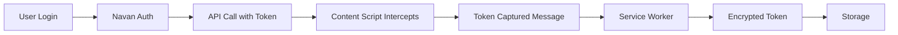
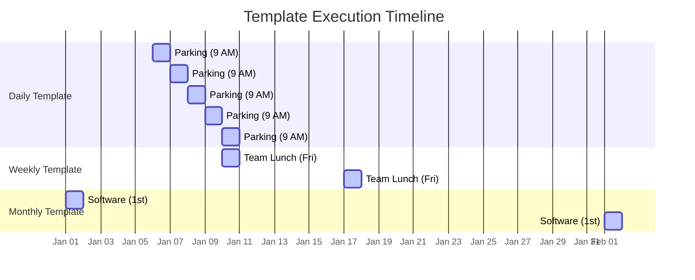

# Core Activities

This guide explains the three core activities that power Expensabl: Token Interception, Expense Creation, and Scheduled Execution.

## Quick Reference

| Activity            | Trigger                         | Key Components                 | Chrome APIs Used               |
|---------------------|---------------------------------|--------------------------------|--------------------------------|
| Token Interception  | User login to Navan             | Content Script, Service Worker | webRequest, storage            |
| Expense Creation    | Template selection/Manual entry | UI Components, Expense Service | storage, runtime               |
| Scheduled Execution | Chrome alarms                   | Scheduler, Template Service    | alarms, storage, notifications |

| Activity            | Prerequisites                   | Data Flow                                      | Storage Output                       |
|---------------------|---------------------------------|------------------------------------------------|--------------------------------------|
| Token Interception  | Active Navan session            | HTTP Headers → Content Script → Service Worker | Encrypted auth token                 |
| Expense Creation    | Valid auth token, Template data | UI → Message Router → API → Storage            | Expense record, Template usage stats |
| Scheduled Execution | Active template with schedule   | Alarm → Service Worker → API                   | Execution history, Created expense   |

## Token Interception

The extension automatically captures authentication tokens when users log into Navan, eliminating the need for manual credential entry. This foundational activity enables all other features by establishing secure API access.

### How It Works

1. **Content Script Monitoring**: The content script monitors network requests on Navan domains
2. **Multiple Capture Strategies**: Uses various techniques to ensure reliable token capture
3. **Secure Storage**: Tokens are encrypted and stored in Chrome's local storage
4. **Automatic Validation**: Validates captured tokens before storage

### Token Capture Flow



### Implementation Details

The token capture system employs a multi-layered approach:

- **Network Interception**: Monitors fetch and XMLHttpRequest calls
- **Header Extraction**: Captures Authorization headers from API requests
- **Validation**: Ensures token format is correct before storage
- **Refresh Detection**: Automatically updates stored tokens when refreshed

### Security Considerations

- Tokens are never logged or exposed in console
- All tokens are encrypted before storage
- Token scope is limited to expense operations
- Automatic cleanup of expired tokens

## Expenses and Templates

The expense and template system forms the core of user interaction, enabling both one-time expense creation and reusable template management.

### Bi-directional Workflow

Users can:
1. **Create expenses from templates**: Apply saved templates to quickly create new expenses
2. **Convert expenses to templates**: Save any expense as a template for future use

### Template Features

#### Template Storage
- Essential expense information without transaction-specific details
- Usage statistics and execution history tracking
- Support for variable substitution (e.g., `{month}`, `{year}`)
- 5-template limit per user for optimal performance

#### Template Management
- **Create**: Save new templates from scratch or existing expenses
- **Edit**: In-place editing with validation
- **Apply**: Generate expenses with pre-filled data
- **Delete**: Remove unused templates with confirmation

### Real-World Use Cases

#### Weekly Team Lunch Template
```
Name: "Friday Team Lunch"
Merchant: "Local Bistro"
Amount: $125.00
Category: "Meals - Team"
Schedule: Weekly (Fridays)
Notes: "Weekly team building lunch"
```

#### Monthly Software Subscription
```
Name: "Design Software License"
Merchant: "Adobe Creative Cloud"
Amount: $52.99
Category: "Software - Subscription"
Schedule: Monthly (1st of month)
Project: "Marketing Dept"
```

#### Client Entertainment Template
```
Name: "Client Dinner Template"
Merchant: "[To be filled]"
Amount: $200.00
Category: "Entertainment - Client"
Schedule: Manual (no automation)
Notes: "Standard client dinner budget"
```

### Template Data Lifecycle

1. **Creation**: User defines template parameters
2. **Storage**: Template saved to Chrome sync storage
3. **Usage**: Template applied to create expenses
4. **Updates**: Usage count and last-used timestamp updated
5. **Sync**: Templates synchronized across devices

## Scheduled Executions

Scheduled executions transform manual expense entry into an automated workflow, leveraging Chrome's alarm API to create expenses at predetermined intervals.

### Supported Schedule Types

- **Daily**: Every day at a specific time
- **Weekly**: Specific day(s) of the week
- **Monthly**: Specific day of the month
- **Custom**: User-defined intervals

### Scheduling Timeline Example



### Chrome Alarm Configuration

The scheduling engine:
- Calculates optimal execution times based on user timezone
- Persists across browser restarts
- Monitors execution history for failure detection
- Supports pause/resume functionality

### Execution Process

1. **Alarm Trigger**: Chrome alarm fires at scheduled time
2. **Template Retrieval**: Fetch template data from storage
3. **Variable Substitution**: Replace placeholders with current values
4. **Expense Creation**: Submit expense via API
5. **History Update**: Log execution result
6. **Next Schedule**: Calculate and set next execution time

### Error Handling

- **Retry Logic**: Automatic retry on network failures
- **Notification**: User notified of persistent failures
- **Fallback**: Manual intervention option for critical expenses
- **Recovery**: Automatic recovery after connection restored

### Real-World Scheduling Examples

#### Daily Parking Expense
```
Template: "Office Parking"
Amount: $15.00
Schedule: Daily (Weekdays only)
Time: 9:00 AM
Auto-submit: Yes
Note: Automatically creates parking expenses for work days
```

#### Bi-weekly Client Dinner
```
Template: "Client Entertainment - Dinner"
Amount: $250.00
Schedule: Every 2 weeks (Thursday)
Time: 6:00 PM
Auto-submit: No (requires receipt)
Note: Reminder for regular client relationship building
```

## Integration Points

### Service Worker
- Central hub for all background operations
- Manages alarms and scheduled executions
- Handles API communication
- Processes messages between contexts

### Content Script
- Injected into Navan pages
- Monitors for authentication tokens
- Minimal footprint for performance

### Side Panel UI
- User interface for all interactions
- Real-time updates via message passing
- Template and schedule management
- Expense review and submission

## Best Practices

### For Token Management
- Let the extension handle token capture automatically
- Don't manually enter tokens
- Sign out and back in if token issues occur

### For Templates
- Use descriptive names for easy identification
- Include variable placeholders for dynamic content
- Review and update templates periodically
- Delete unused templates to stay under the limit

### For Scheduling
- Set schedules based on your timezone
- Use appropriate frequencies for expense types
- Monitor execution history regularly
- Pause schedules during vacations or breaks

## Troubleshooting

### Token Not Captured
1. Ensure you're signed into Navan
2. Refresh the page after extension installation
3. Check service worker logs for errors
4. Try signing out and back in

### Template Not Saving
1. Check template limit (max 5)
2. Verify all required fields are filled
3. Ensure Chrome sync is enabled
4. Check storage quota in Chrome

### Schedule Not Executing
1. Verify Chrome is running at scheduled time
2. Check alarm permissions in manifest
3. Review execution history for errors
4. Ensure template is not paused