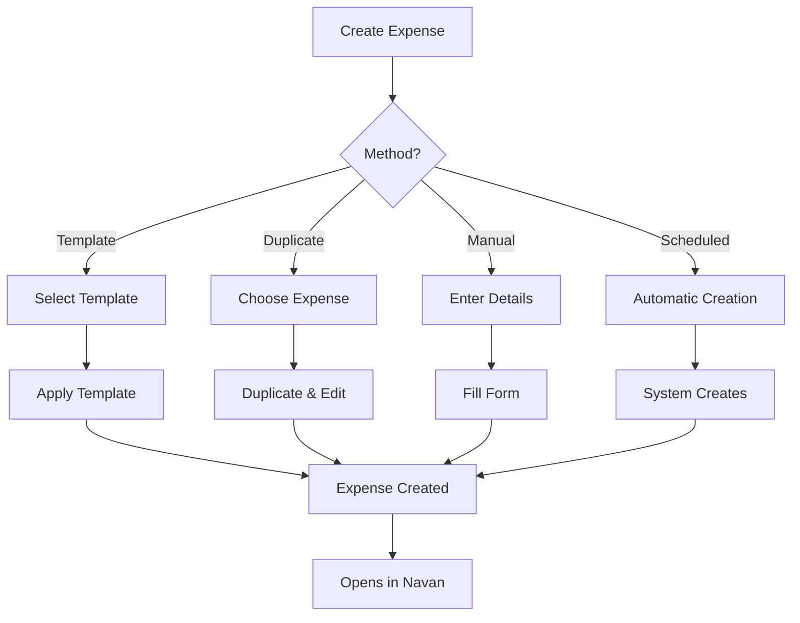

# Creating Expenses

This guide covers all methods for creating expenses in Expensabl, including manual creation, templates, duplication, and best practices for efficient expense management.

## Quick Reference

| Method | Best For | Time Required | Prerequisites |
|--------|----------|---------------|---------------|
| From Template | Recurring expenses | 2 clicks | Saved template |
| Duplicate Expense | Similar one-time expenses | 3 clicks | Existing expense |
| Manual Creation | Unique expenses | 2-5 minutes | Expense details |
| Scheduled Template | Automated recurring | Automatic | Configured schedule |

## Creation Methods Overview

## Creating from Templates

The fastest way to create recurring expenses. Templates store all expense details and can be applied instantly.

### How to Apply a Template

1. **Open Templates Section**: Click on "Templates" in the side panel
2. **Select Template**: Find your desired template card
3. **Apply Template**: Click "Apply Template" button
4. **Automatic Actions**:
   - New expense is created with today's date
   - Expense opens in Navan for review
   - Expense appears in your expense list

### Template Features

- **One-Click Creation**: Instant expense generation
- **Usage Tracking**: See how often each template is used
- **Execution History**: Track when expenses were created
- **Scheduling Option**: Set up automatic creation

### Best Practices for Templates

- Create templates for all recurring expenses (internet, phone, subscriptions)
- Name templates clearly (e.g., "Monthly Internet - Home Office")
- Update template amounts when prices change
- Review template usage monthly to identify patterns

## Duplicating Expenses

Perfect for creating similar expenses with minor variations.

### How to Duplicate

1. **View Expense**: Click on any expense in "My Expenses" list
2. **Click Duplicate**: Press the "Duplicate Expense" button
3. **Automatic Actions**:
   - Creates new expense with today's date
   - Copies all fields from original
   - Opens in Navan for editing
   - Shows in expense detail panel

### When to Duplicate

- **Similar Purchases**: Same vendor, different amount
- **Repeat Transactions**: Same expense, new period
- **Team Expenses**: Same event, multiple attendees
- **Corrected Submissions**: Fix rejected expenses

### Duplication Tips

- The new expense gets today's date automatically
- All fields are copied except the expense ID
- Receipts are not copied (add new ones if needed)
- Edit immediately after duplication for accuracy

## Manual Expense Creation

For unique, one-time expenses that don't fit templates.

### Required Fields

| Field | Description | Example | Validation |
|-------|-------------|---------|------------|
| **Date** | When expense occurred | 2024-01-15 | Cannot be future date |
| **Amount** | Expense amount | 45.99 | Must be positive number |
| **Currency** | Payment currency | USD | Valid ISO currency code |
| **Merchant** | Vendor/supplier name | Office Depot | Required, text field |
| **Category** | Expense type | Office Supplies | From predefined list |
| **Description** | Expense details | Printer paper for Q1 | Optional but recommended |

### Optional Fields

| Field | Purpose | When to Use |
|-------|---------|-------------|
| **Project Code** | Link to project | Client billable expenses |
| **Cost Center** | Department allocation | Departmental budgets |
| **Tags** | Categorization | Searchability |
| **Attendees** | Meeting participants | Meal expenses |
| **Location** | Where incurred | Travel expenses |
| **Purpose** | Business justification | Policy compliance |

### Step-by-Step Process

1. **Gather Information**:
   - Receipt or invoice
   - Business purpose
   - Project/client details

2. **Start Creation**:
   - Navigate to expense creation form
   - Select expense date

3. **Enter Core Details**:
   - Input amount and currency
   - Enter merchant name
   - Select appropriate category

4. **Add Context**:
   - Write clear description
   - Add business justification
   - Link to project if applicable

5. **Attach Documentation**:
   - Upload receipt image
   - Add supporting documents

6. **Review and Submit**:
   - Verify all information
   - Check policy compliance
   - Submit expense

## Field Customization

Customize which fields appear in your expense detail view for faster data entry.

### How to Customize Fields

1. **Open Any Expense**: View expense details
2. **Click Customize Display**: Purple button with gear icon
3. **Select Fields**: Choose up to 8 fields to display
4. **Drag to Reorder**: Arrange fields by importance
5. **Save Changes**: Click "Save Changes"

### Recommended Field Configurations

**For Travelers**:
- Date, Amount, Merchant
- Location, Purpose
- Project Code
- Receipt Status
- Approval Status

**For Remote Workers**:
- Date, Amount, Merchant
- Category, Description
- Cost Center
- Receipt Status
- Reimbursement Status

**For Managers**:
- Date, Amount, Merchant
- Employee, Department
- Approval Status
- Policy Violations
- Notes

## Receipt Management

Proper receipt handling ensures compliance and faster reimbursement.

### Uploading Receipts

1. **In Expense Detail**: Click "Upload Receipt" button
2. **Select File**: Choose image or PDF
3. **Automatic Upload**: File uploads immediately
4. **Verification**: Confirm receipt appears

### Receipt Requirements

- **File Types**: JPG, PNG, PDF
- **File Size**: Maximum 10MB
- **Quality**: Readable text and amounts
- **Content**: Full receipt visible

### Best Practices

- Upload receipts immediately after purchase
- Take clear photos in good lighting
- Keep original receipts until reimbursed
- Name files descriptively before upload

## Validation and Compliance

Understanding validation rules helps avoid rejections.

### Common Validation Rules

| Rule | Description | How to Comply |
|------|-------------|---------------|
| **Date Range** | Within policy period | Check company policy |
| **Amount Limits** | Category maximums | Split large expenses |
| **Receipt Required** | For amounts over threshold | Always attach receipts |
| **Pre-Approval** | For certain categories | Get approval first |
| **Duplicate Check** | Prevents double submission | Review before submitting |

### Policy Compliance Tips

1. **Know Your Limits**: Understand category spending limits
2. **Document Everything**: Keep all receipts and notes
3. **Submit Promptly**: Don't wait until deadline
4. **Provide Context**: Explain business purpose clearly
5. **Follow Guidelines**: Adhere to company expense policy

## Bulk Operations

Efficiently handle multiple expenses at once.

### Creating Multiple Expenses

**From Templates**:
1. Create template for base expense
2. Apply template multiple times
3. Edit each for specific details

**Using Duplication**:
1. Create first expense completely
2. Duplicate for each variation
3. Modify dates and amounts

### Tips for Bulk Creation

- Process similar expenses together
- Use consistent descriptions
- Apply same project codes in batches
- Review all before final submission

## Troubleshooting

### Common Issues and Solutions

**"Missing Required Field" Error**:
- Check all mandatory fields are filled
- Verify date format is correct
- Ensure amount is positive number

**"Duplicate Expense" Warning**:
- Check if already submitted
- Verify date and amount combination
- Look for similar recent expenses

**"Policy Violation" Alert**:
- Review company expense policy
- Check category limits
- Verify receipt is attached
- Add business justification

**"Failed to Create" Error**:
- Check internet connection
- Verify authentication status
- Try refreshing the page
- Contact support if persists

## Automation Tips

### Setting Up Efficient Workflows

1. **Template Everything**: Create templates for all recurring expenses
2. **Schedule Regular**: Use scheduling for predictable expenses
3. **Batch Processing**: Handle similar expenses together
4. **Quick Duplicate**: Use duplication for variations
5. **Field Presets**: Customize fields for your needs

### Time-Saving Shortcuts

- **Keyboard Navigation**: Use Tab to move between fields
- **Auto-Complete**: Let browser fill repeated entries
- **Template Hotkeys**: Quick access to frequent templates
- **Bulk Upload**: Process multiple receipts at once
- **Smart Defaults**: Set default values in templates

## Best Practices Summary

### Do's
✅ Create templates for recurring expenses
✅ Upload receipts immediately
✅ Provide clear descriptions
✅ Submit expenses promptly
✅ Keep original documentation
✅ Review before submitting
✅ Use appropriate categories
✅ Include business purpose

### Don'ts
❌ Wait until deadline to submit
❌ Submit without receipts
❌ Use vague descriptions
❌ Ignore policy limits
❌ Duplicate submissions
❌ Mix personal and business
❌ Forget project codes
❌ Skip required fields

## Advanced Features

### Integration with Navan

When you create an expense in Expensabl:
1. It syncs immediately with Navan
2. Opens in Navan for review/edit
3. Follows Navan approval workflow
4. Updates status in real-time

### Expense Analytics

Track your expense patterns:
- Most used templates
- Common categories
- Average amounts
- Submission frequency
- Approval rates

## Getting Help

If you need assistance:

1. **Check Documentation**: Review this guide
2. **Policy Questions**: Contact your finance team
3. **Technical Issues**: Check troubleshooting section
4. **Feature Requests**: Submit via feedback form
5. **Bug Reports**: Include error messages and steps