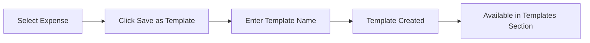
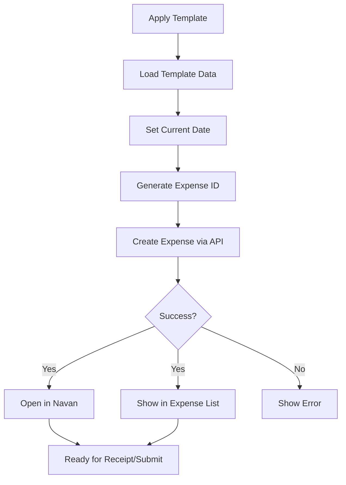

# Templates

This guide covers the template system in Expensabl, including creating, managing, scheduling, and applying templates for efficient expense management.

## Quick Reference

| Feature | Description | Limit/Requirement |
|---------|-------------|-------------------|
| Template Creation | Save expense patterns for reuse | Maximum 5 templates |
| From Expense | Convert any expense to template | One-click conversion |
| Template Application | Create expenses from templates | Instant with current date |
| Scheduling | Automate template execution | Daily/Weekly/Monthly |
| Usage Tracking | Monitor template utilization | Automatic statistics |

## Understanding Templates

Templates are reusable expense patterns that store common expense information without transaction-specific details like dates or receipt IDs. They're designed to eliminate repetitive data entry for recurring expenses.

### Template vs Expense

| Aspect | Template | Expense |
|--------|----------|---------|
| **Purpose** | Reusable pattern | Single transaction |
| **Date** | Not stored | Specific date |
| **Receipt** | Not included | Can have receipt |
| **Usage** | Multiple times | One-time record |
| **Storage** | Chrome sync storage | Navan database |
| **Limit** | 5 per user | Unlimited |

### When to Use Templates

**Perfect for:**
- Regular subscriptions (software, services)
- Recurring travel expenses (parking, tolls)
- Standard meal expenses (team lunches, client dinners)
- Fixed monthly bills (internet, phone)
- Common office supplies purchases

**Not ideal for:**
- One-time unique expenses
- Variable amounts with no pattern
- Expenses requiring different details each time

## Creating Templates

### Method 1: From Existing Expense

The easiest way to create a template is from an expense you've already created.

1. **View Expense**: Click on any expense in "My Expenses"
2. **Save as Template**: Click "Save as Template" button
3. **Name Template**: Enter a descriptive name
4. **Confirm Save**: Template is created instantly



### Method 2: Create New Template

Create a template directly without an existing expense.

1. **Open Templates Section**: Navigate to Templates tab
2. **Click Create Template**: Start new template form
3. **Fill Required Fields**:
   - Template Name
   - Merchant
   - Amount
   - Currency
   - Category
4. **Add Optional Fields**:
   - Description
   - Project Code
   - Cost Center
   - Tags
5. **Save Template**: Click "Save" button

### Template Fields

#### Required Fields

| Field | Description | Example | Tips |
|-------|-------------|---------|------|
| **Name** | Template identifier | "Monthly Internet" | Be specific and descriptive |
| **Merchant** | Vendor/supplier | "Comcast Business" | Use official business name |
| **Amount** | Default amount | 149.99 | Update when prices change |
| **Currency** | Payment currency | USD | Match your usual currency |
| **Category** | Expense type | "Utilities" | Use consistent categories |

#### Optional Fields

| Field | Purpose | When to Include |
|-------|---------|-----------------|
| **Description** | Additional context | For complex expenses |
| **Project Code** | Project allocation | Client-billable work |
| **Cost Center** | Department charging | Department-specific |
| **Tags** | Categorization | For reporting needs |
| **Notes** | Business justification | Policy requirements |

### Template Naming Best Practices

**Good Names:**
- "Monthly Home Internet - Remote Work"
- "Weekly Team Lunch - Friday"
- "Client Dinner - Standard Budget"
- "Uber to Airport - Business Travel"
- "Office Supplies - Monthly Restock"

**Poor Names:**
- "Template 1"
- "Expense"
- "Monthly"
- "Food"
- "Misc"

## Managing Templates

### The 5-Template Limit

Expensabl limits users to 5 templates to ensure optimal performance and encourage thoughtful template management.

#### Strategies for the Limit

1. **Focus on Frequency**: Create templates for your most frequent expenses
2. **Combine Similar**: Use one template for similar expenses (e.g., "Client Entertainment")
3. **Seasonal Rotation**: Delete and recreate based on current needs
4. **Generic Templates**: Create flexible templates you can modify when applying

#### Template Priority Matrix

| Frequency | Fixed Amount | Priority |
|-----------|--------------|----------|
| Daily | Yes | Highest |
| Weekly | Yes | High |
| Monthly | Yes | High |
| Weekly | Variable | Medium |
| Monthly | Variable | Medium |
| Occasional | Yes | Low |
| Occasional | Variable | Lowest |

### Editing Templates

Templates can be edited in place without creating duplicates.

1. **Open Template**: Click on template card
2. **Click Edit**: Enter edit mode
3. **Modify Fields**: Change any field except template ID
4. **Save Changes**: Updates immediately
5. **Affects Future Use**: Only affects new expenses, not past ones

### Deleting Templates

Remove templates you no longer need.

1. **Select Template**: Click on template to view
2. **Click Delete**: Confirmation dialog appears
3. **Confirm Deletion**: Template is permanently removed
4. **Frees Slot**: Can now create new template

**Note**: Deleting a template doesn't affect expenses already created from it.

## Applying Templates

### Manual Application

Create an expense instantly from a template.

1. **Navigate to Templates**: Open Templates section
2. **Select Template**: Click on desired template
3. **Click Apply**: Press "Apply Template" button
4. **Automatic Actions**:
   - New expense created with today's date
   - All template fields copied
   - Expense opens in Navan for review
   - Appears in expense list immediately

### What Happens During Application



### Post-Application Actions

After applying a template:
1. **Review Details**: Verify all information is correct
2. **Add Receipt**: Upload receipt if required
3. **Modify if Needed**: Edit any fields that vary
4. **Submit Expense**: Complete submission in Navan

## Template Scheduling

Automate expense creation with scheduled templates.

### Setting Up Schedules

1. **Open Template**: Select template to schedule
2. **Click Schedule**: Access scheduling options
3. **Choose Frequency**:
   - Daily
   - Weekly (select days)
   - Monthly (select date)
   - Custom interval
4. **Set Time**: Choose execution time
5. **Enable Schedule**: Activate automation

### Schedule Types

#### Daily Schedule
```
Frequency: Every day
Time: 9:00 AM
Use Case: Daily parking, meals
Example: Weekday lunch expense
```

#### Weekly Schedule
```
Frequency: Every Friday
Time: 12:00 PM
Use Case: Team lunches, weekly services
Example: Friday team building lunch
```

#### Monthly Schedule
```
Frequency: 1st of month
Time: 10:00 AM
Use Case: Subscriptions, bills
Example: Software license renewal
```

### Managing Scheduled Templates

#### Schedule Status Indicators
- 🟢 **Active**: Schedule is running
- 🟡 **Paused**: Temporarily disabled
- 🔴 **Error**: Execution failed
- ⏰ **Pending**: Next execution waiting

#### Pausing Schedules
Useful during vacations or temporary changes:
1. Open scheduled template
2. Click "Pause Schedule"
3. Schedule stops but isn't deleted
4. Resume when ready

#### Execution History

Track automated executions:
- **Success Count**: Number of successful creations
- **Last Execution**: Timestamp of last run
- **Next Scheduled**: Upcoming execution time
- **Failure Log**: Any errors encountered

### Schedule Best Practices

1. **Time Zone Aware**: Set schedules in your local time
2. **Business Days**: Consider weekends and holidays
3. **Execution Time**: Choose times when system is less busy
4. **Monitor Regularly**: Check execution history weekly
5. **Update Amounts**: Adjust template amounts when prices change

## Template Analytics

### Usage Tracking

Templates automatically track:
- **Usage Count**: Times template has been applied
- **Last Used**: Most recent application
- **Success Rate**: Percentage of successful applications
- **Total Amount**: Cumulative expense value created
- **Average Frequency**: How often template is used

### Optimizing Templates

Review analytics monthly to:
1. **Identify Unused**: Delete templates used less than once per month
2. **Find Patterns**: Create templates for frequent manual expenses
3. **Update Amounts**: Adjust for price changes
4. **Merge Similar**: Combine templates with overlapping use
5. **Seasonal Adjusts**: Modify based on business cycles

## Real-World Examples

### Example 1: Internet Subscription
```json
{
  "name": "Monthly Internet - Home Office",
  "merchant": "Comcast Business",
  "amount": 99.99,
  "currency": "USD",
  "category": "Utilities",
  "description": "Business internet for remote work",
  "project_code": "OVERHEAD",
  "schedule": {
    "type": "monthly",
    "day": 1,
    "time": "09:00"
  }
}
```

### Example 2: Client Lunch Template
```json
{
  "name": "Client Lunch - Standard",
  "merchant": "[Variable]",
  "amount": 150.00,
  "currency": "USD",
  "category": "Meals - Client",
  "description": "Client relationship building",
  "tags": ["client", "entertainment"],
  "schedule": null
}
```

### Example 3: Daily Parking
```json
{
  "name": "Office Parking - Weekday",
  "merchant": "City Parking Authority",
  "amount": 12.00,
  "currency": "USD",
  "category": "Transportation",
  "description": "Daily office parking",
  "cost_center": "ADMIN",
  "schedule": {
    "type": "daily",
    "excludeWeekends": true,
    "time": "08:00"
  }
}
```

## Template Workflow Strategies

### Strategy 1: Category-Based Templates
Create one template per major category:
- "Standard Client Meal"
- "Typical Office Supplies"
- "Regular Transportation"
- "Monthly Subscription"
- "Team Event"

### Strategy 2: Frequency-Based Templates
Organize by how often used:
- "Daily Expense" (parking, coffee)
- "Weekly Expense" (team lunch)
- "Monthly Fixed" (subscriptions)
- "Monthly Variable" (supplies)
- "Occasional" (client entertainment)

### Strategy 3: Amount-Based Templates
Group by expense size:
- "Small Routine" (< $25)
- "Medium Regular" ($25-100)
- "Large Recurring" ($100-500)
- "Major Monthly" (> $500)
- "Variable Business" (any amount)

## Troubleshooting

### Common Issues

#### "Template Limit Reached"
**Problem**: Cannot create new template, already have 5.

**Solution**:
1. Review existing templates
2. Delete least-used template
3. Consider merging similar templates
4. Create more generic template

#### "Template Not Applying"
**Problem**: Clicking "Apply Template" doesn't create expense.

**Solution**:
1. Check authentication status
2. Verify internet connection
3. Ensure all required fields have values
4. Try refreshing the extension

#### "Schedule Not Executing"
**Problem**: Scheduled template isn't creating expenses.

**Solution**:
1. Verify Chrome is running at scheduled time
2. Check execution history for errors
3. Ensure template hasn't been paused
4. Verify authentication is valid

#### "Template Changes Not Saving"
**Problem**: Edits to template aren't persisting.

**Solution**:
1. Check Chrome sync is enabled
2. Verify storage permissions
3. Try logging out and back in
4. Clear extension cache

### Template Recovery

If templates are lost:
1. Check Chrome sync on other devices
2. Review recent expenses to recreate
3. Check browser console for errors
4. Contact support with template names

## Advanced Features

### Variable Substitution

Templates support dynamic variables:
- `{date}` - Current date
- `{month}` - Current month name
- `{year}` - Current year
- `{quarter}` - Current quarter (Q1-Q4)

Example: "Internet Bill - {month} {year}"

### Conditional Templates

Use scheduling conditions:
- Skip weekends
- Skip holidays
- Skip specific dates
- Run only on business days

### Bulk Template Operations

Coming soon:
- Export templates to JSON
- Import templates from file
- Share templates with team
- Template versioning

## Best Practices Summary

### Do's
✅ Name templates descriptively
✅ Keep templates updated with current amounts
✅ Review usage statistics monthly
✅ Delete unused templates
✅ Use scheduling for predictable expenses
✅ Test templates after creation
✅ Document template purpose in description

### Don'ts
❌ Create templates for one-time expenses
❌ Use vague template names
❌ Exceed the 5-template limit
❌ Ignore failed scheduled executions
❌ Forget to update amounts when prices change
❌ Create duplicate templates
❌ Leave broken templates active

## Integration with Expenses

### Template to Expense Flow
1. Template defines the pattern
2. Application creates the expense
3. Expense opens for review/edit
4. Receipt can be added
5. Expense submitted through Navan

### Expense to Template Flow
1. Create expense normally
2. Save successful expense as template
3. Template preserves field values
4. Remove transaction-specific data
5. Template ready for reuse

## Getting Help

If you need assistance with templates:

1. **Check Usage Stats**: Review template analytics
2. **Documentation**: Consult this guide
3. **Execution History**: Check for error patterns
4. **Console Logs**: Look for technical errors
5. **Support**: Contact with template details